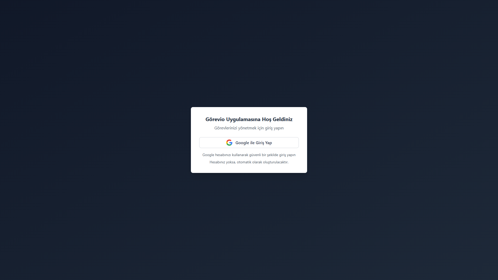
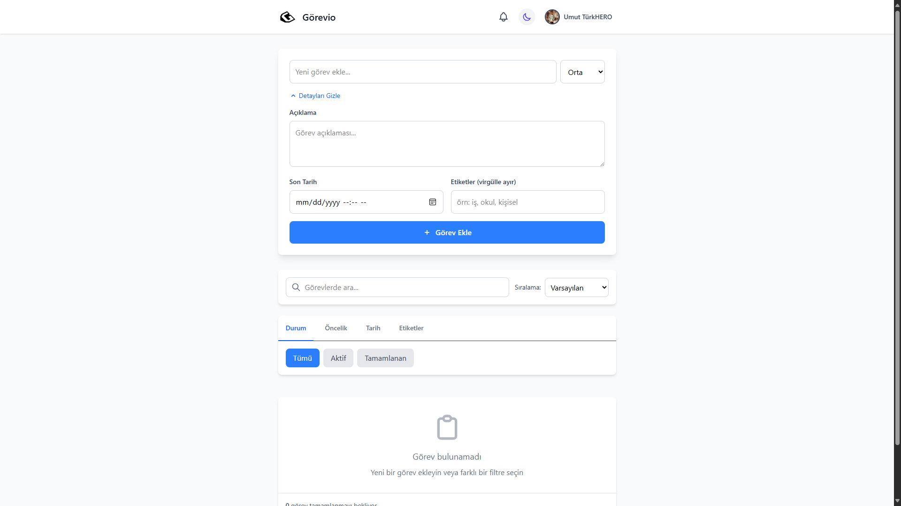

# 📝 Görevio - Modern Todo Uygulaması


Görevio, modern ve kullanıcı dostu bir görev yönetim uygulamasıdır. Firebase kimlik doğrulama ve gerçek zamanlı veritabanı ile entegre edilmiş, React tabanlı bu uygulama, görevlerinizi etkili bir şekilde organize etmenizi sağlar.

## ✨ Özellikler

- 🔐 **Google ile Giriş**: Güvenli ve hızlı giriş deneyimi
- 🌓 **Aydınlık/Karanlık Tema**: Göz yormayan arayüz seçenekleri
- ➕ **Görev Ekleme/Düzenleme/Silme**: Tam kapsamlı görev yönetimi
- 🔍 **Görev Arama**: Görevleriniz arasında hızlıca arama yapın
- 🏷️ **Etiketler ve Öncelikler**: Görevlerinizi kategorize edin ve önemlerine göre sıralayın
- 📊 **Görev İstatistikleri**: Görev tamamlama oranları ve performans takibi
- 🔔 **Bildirimler**: Önemli görevler için hatırlatmalar
- 📱 **Responsive Tasarım**: Mobil ve masaüstü cihazlarda kusursuz deneyim
- 🔄 **Gerçek Zamanlı Güncelleme**: Firebase ile anlık veri senkronizasyonu

## 🖼️ Ekran Görüntüleri

### Giriş Ekranı



### Görev Listesi


### Görev Ekleme/Düzenleme



## 🛠️ Kullanılan Teknolojiler

- **Frontend**:
  - React 19
  - Tailwind CSS
  - Context API (State Yönetimi)
- **Backend**:
  - Firebase Authentication
  - Firestore Database
- **Geliştirme Araçları**:
  - Vite.js
  - ESLint
  - PNPM

## 🚀 Kurulum

### Ön Koşullar

- Node.js (v18 veya üzeri)
- PNPM
- Firebase Hesabı

### Adımlar

1. **Repoyu klonlayın**:

   ```bash
   git clone https://github.com/UmutTKMN/gorevio.git
   cd gorevio
   ```

2. **Bağımlılıkları yükleyin**:

   ```bash
   pnpm install
   ```

3. **Firebase yapılandırması**:

   - Firebase konsolundan yeni bir proje oluşturun
   - Authentication ve Firestore Database'i etkinleştirin
   - Google giriş yöntemini etkinleştirin
   - `.env` dosyasını projenizin kök dizinine oluşturun:

   ```env
   VITE_FIREBASE_API_KEY=your-api-key
   VITE_FIREBASE_AUTH_DOMAIN=your-auth-domain
   VITE_FIREBASE_PROJECT_ID=your-project-id
   VITE_FIREBASE_STORAGE_BUCKET=your-storage-bucket
   VITE_FIREBASE_MESSAGING_SENDER_ID=your-messaging-sender-id
   VITE_FIREBASE_APP_ID=your-app-id
   VITE_FIREBASE_MEASUREMENT_ID=your-measurement-id
   ```

4. **Uygulamayı başlatın**:

   ```bash
   pnpm dev
   ```

5. Tarayıcınızda `http://localhost:5173` adresine gidin ve Görevio'yu kullanmaya başlayın.

## 📋 Kullanım

1. **Hesap Oluşturma/Giriş**:

   - Google hesabınızla giriş yapın

2. **Görev Ekleme**:

   - "Yeni görev ekle" düğmesine tıklayın
   - Görev başlığı, açıklama ve varsa bitiş tarihi girin
   - İsteğe bağlı olarak görevin önceliğini belirleyin
   - Etiketler ekleyerek görevlerinizi kategorize edin

3. **Görev Yönetimi**:

   - Görevleri tamamlamak için yanındaki kutucuğu işaretleyin
   - Görevleri düzenlemek için kalem simgesine tıklayın
   - Görevleri silmek için çöp kutusu simgesine tıklayın
   - Görev detaylarını görmek için görevin üzerine tıklayın

4. **Filtreleme ve Arama**:
   - Görevleri önceliğe, tarihe veya tamamlanma durumuna göre filtreleyin
   - Arama kutusunu kullanarak görevler arasında arama yapın

## 🛡️ Güvenlik Özellikleri

- **Veri Doğrulama**: Tüm kullanıcı girdileri sunucu tarafında doğrulanır
- **XSS Koruması**: Metin girdileri otomatik olarak temizlenir
- **Rate Limiting**: API istekleri için hız sınırlaması
- **Firebase Güvenlik Kuralları**: Kullanıcıların yalnızca kendi verilerine erişmesini sağlar

## 📱 Tarayıcı Desteği ve Uyumluluk

Görevio, modern tarayıcıların tüm versiyonlarında en iyi performansı gösterir:

- Chrome (son 2 sürüm)
- Firefox (son 2 sürüm)
- Safari (son 2 sürüm)
- Edge (son 2 sürüm)

**Not**: Tarayıcı takip önleme özelliği aktif olduğunda, bazı işlevler sınırlı olabilir. Bu durumda uygulama size yardımcı olmak için bir uyarı gösterecektir.

## 🤝 Katkıda Bulunma

Katkılarınızı memnuniyetle karşılıyoruz! Projeye katkıda bulunmak için:

1. Bu repoyu forklayın
2. Yeni bir özellik dalı oluşturun (`git checkout -b yeni-ozellik`)
3. Değişikliklerinizi yapın ve commit edin (`git commit -m 'Yeni özellik: Açıklama'`)
4. Dalınıza push edin (`git push origin yeni-ozellik`)
5. Bir Pull Request oluşturun

## 📄 Lisans

Bu proje MIT lisansı altında lisanslanmıştır. Detaylar için [LICENSE](LICENSE) dosyasına bakın.

## 📞 İletişim

- Website: [kahrastudio.art](https://kahrastudio.art)
- Email: info@kahrastudio.art
- Twitter: [@kahrastudio](https://twitter.com/kahrastudio)
- Instagram: [@kahrastudio](https://instagram.com/kahrastudio)

## 🙏 Teşekkürler
